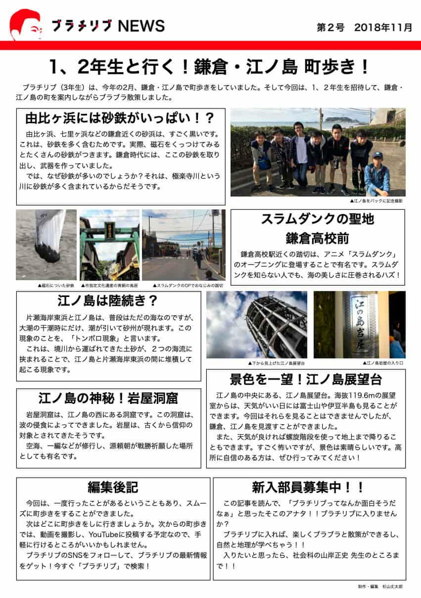
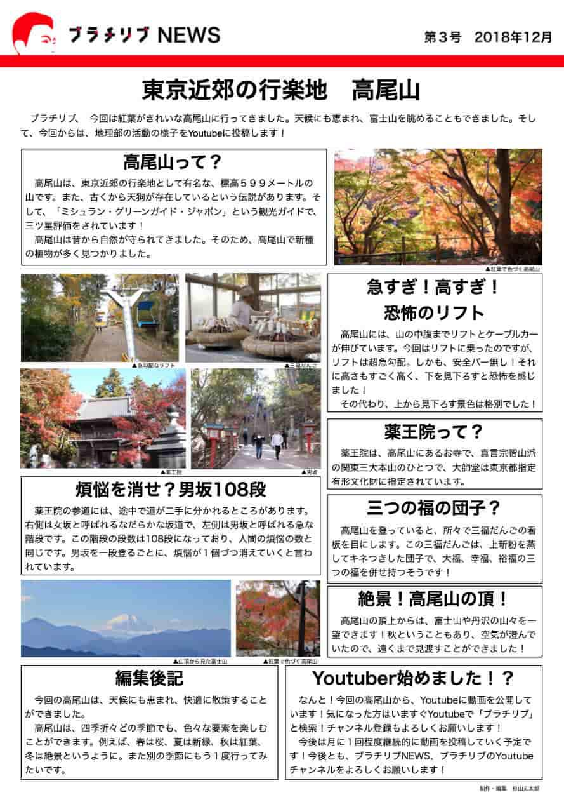

# 新聞「ブラチリブNEWS」発行 概要

地理部「ブラチリブ」では、巡検や調査結果をまとめた新聞「ブラチリブNEWS」を定期的に発行しました。部員と手分けして記事の文章作成を行い、責任編集のもとで発行しました。

## 編集・執筆の工夫

- 訪問した観光地の紹介や、設定したテーマに関する調査結果を分かりやすくまとめました。
- 動画の撮影・編集は全て自分が担当し、記事と連動したコンテンツ作りを意識しました。
- 毎月発行を目標に、部員と協力してスケジュール管理や内容のブラッシュアップを行いました。

## 発行の意義・成果

- 巡検の記録や学びを形に残すことで、部員や学校内外の人々に活動の成果を伝えることができました。
- 新聞発行を通じて、文章力や編集力、チームでの協働力が向上しました。

## 画像ギャラリー

新聞「ブラチリブNEWS」紙面1

新聞「ブラチリブNEWS」紙面2
 