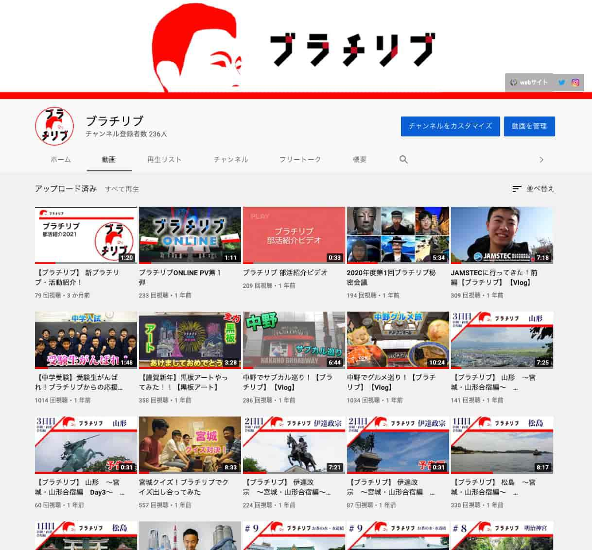
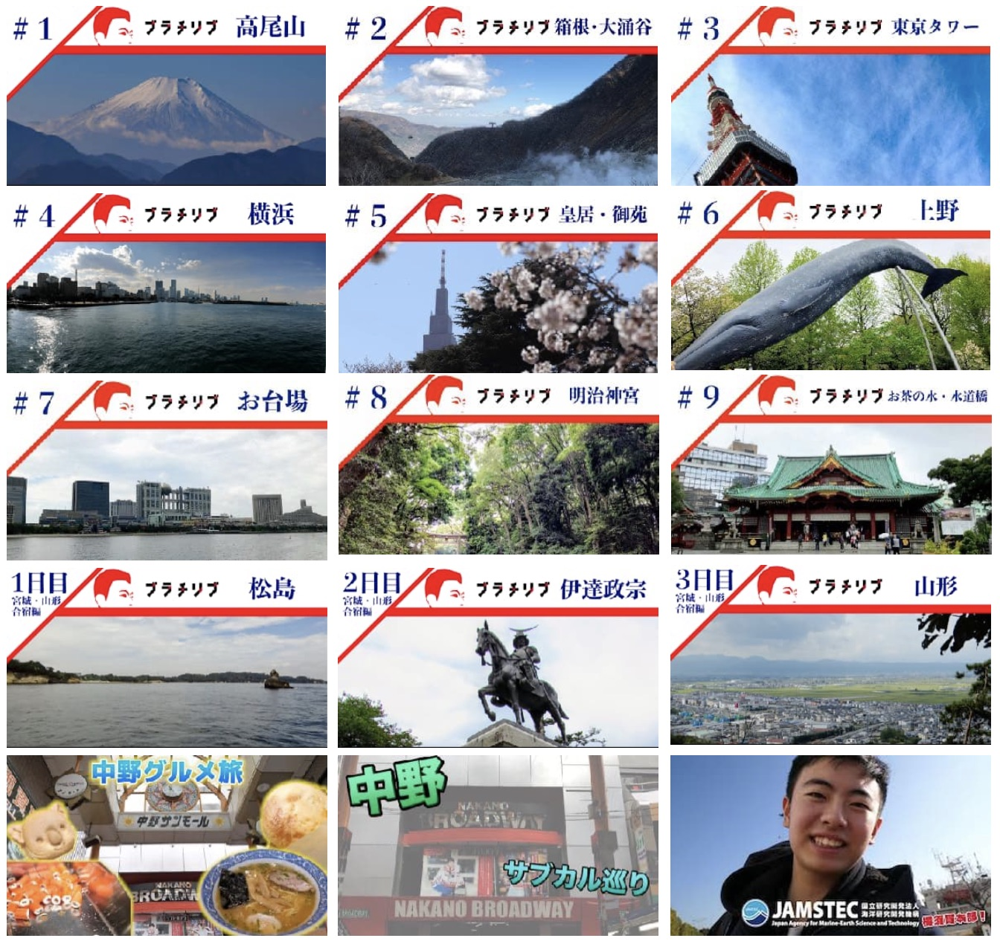
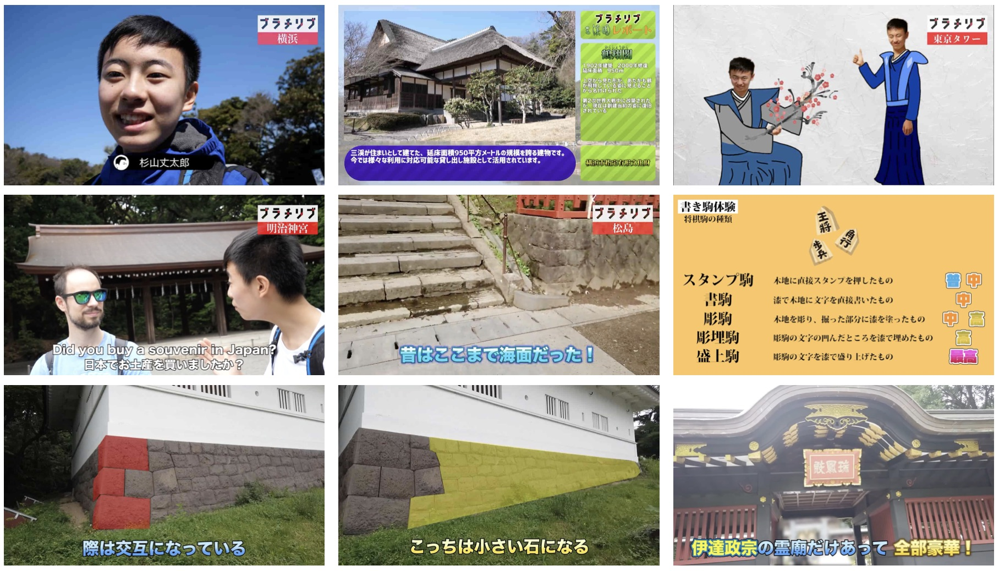
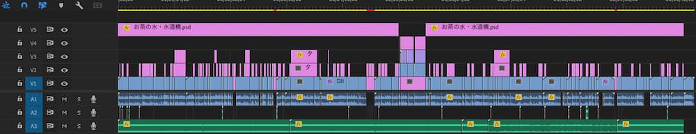
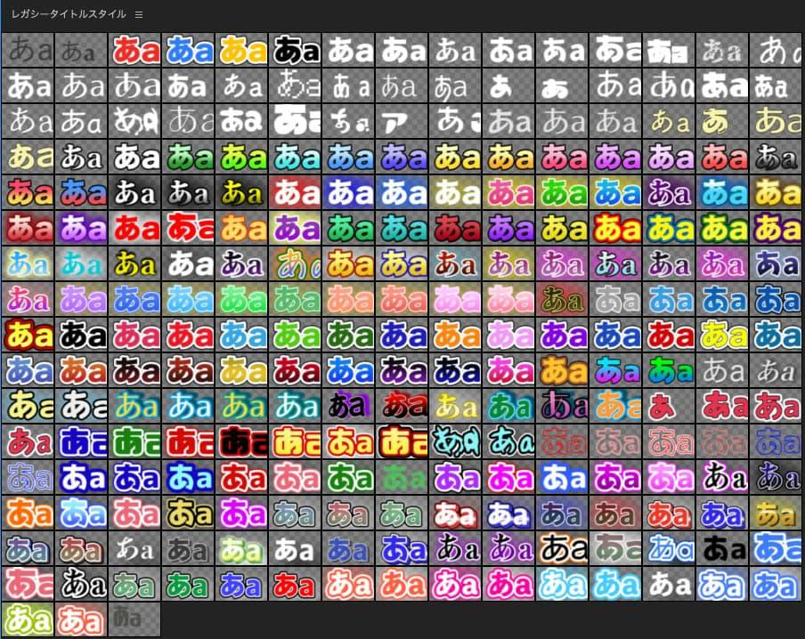

# YouTubeチャンネル運営 概要

地理部「ブラチリブ」では、観光や部活動の様子を動画で記録し、YouTubeで発信する活動を行いました。2018年11月の高尾山巡検から本格的に動画投稿を開始し、以降40本以上の動画を投稿、チャンネル登録者数は236人（資料時点）に達しました。

## 企画・運営の背景

- 観光の面白さや部活動の魅力を、より多くの人に伝えたいという思いから、YouTubeチャンネルを立ち上げました。
- 企画、撮影、編集の全工程を自ら担当し、部員の協力も得ながらコンテンツを制作しました。

## 動画制作の工夫

- 観光地で得た情報や体験、感じたことを短くわかりやすく伝えることを心がけました。
- テレビ番組やYouTube上の動画を参考に、文字のフォントや色使い、構成に工夫を凝らしました。
- 初期は撮影した素材を全て活用していましたが、慣れてくると動画全体の構成を考え、素材の取捨選択ができるようになりました。
- 撮影許可を取るために観光地や施設の方と交渉する経験も積みました。

## 成果・学び

- 動画企画力、編集スキル、交渉力など、実践的なスキルを習得しました。
- 観光地について事前に調べ、実際に訪れ、見て、触れることで主体的に学びを深めることができました。
- 動画を通して観光の面白さを伝えるため、様々な表現方法や手法を身につけました。

## 画像ギャラリー

YouTubeチャンネルのスクリーンショット

YouTubeサムネイル集

動画のスクリーンショット

Premiere Proのタイムライン

テロップデザイン一覧
 